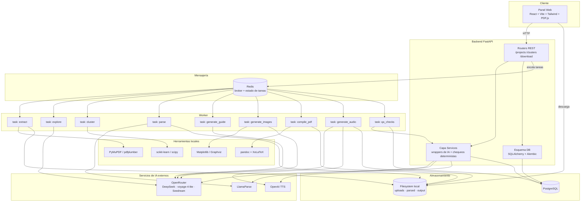

# Simplify — Propuesta de MVP (v2)

> Documento para entender **qué modelos de IA uso, para qué, cómo se conectan
> y por qué cada elección es esa y no otra**. Incluye el marco conceptual del
> producto, las decisiones de arquitectura justificadas y el pipeline completo.
> Pensado para decidir si esta propuesta es la mejor opción **antes** de
> escribir una línea de código.

**Qué cambia respecto a la v1** (si ya la leíste, esto te pone al día):

1. **Se corrige el orden del pipeline**: primero se extrae texto barato, luego
   se explora y se limpia, y solo después de agrupar se paga el parseo de
   calidad. La v1 "exploraba" contenido que aún no había parseado.
2. **Una sola guía por proyecto**, no "1–3 por clúster". La spec habla de
   *un* documento consolidado y *una* guía ejecutiva. El clustering agrupa
   y deduplica *dentro* de esa única guía; no multiplica entregables.
3. **Embeddings: Qwen3 → `voyageai/voyage-4-lite`** (más barato, contexto de
   32k que permite un vector por documento sin trocear).
4. **Se elimina el "juez visual" con DeepSeek**: DeepSeek-V4-Flash es un
   modelo de *texto*, no ve imágenes. Ese juez era teatro. Lo que queda son
   chequeos deterministas.
5. **Infraestructura recortada**: sin S3/MinIO, sin pgvector, sin Celery si
   no hace falta. Solo lo que el problema pide.

**Cómo leer este documento:**

- Sección 1: el concepto del producto en palabras (empieza aquí).
- Secciones 4 y 5: por qué cada decisión técnica y cada modelo (las justificaciones).
- Sección 7: el flujo completo de un vistazo.
- Sección 12: cómo sabemos que el resultado cumple la spec.

---

## 1. Marco conceptual

Antes de hablar de modelos, hay que ponerse de acuerdo en las palabras y en
el dibujo mental del producto.

### 1.1 Vocabulario

| Término | Qué es | Qué NO es |
|---------|--------|-----------|
| Documento fuente | PDF o archivo que sube el usuario | La guía |
| Extracción barata | Texto crudo obtenido en local (PyMuPDF) para poder decidir | El parseo de calidad |
| Exploración | Inferir tipo, tema y relevancia de cada documento | Agrupar |
| Limpieza previa | Sacar documentos vacíos, de solo firmas o ilegibles y **reportarlos** | Clustering |
| Embedding | Vector numérico que representa un documento para medir similitud | Un resumen en español |
| Clustering | Agrupar documentos afines para fusionarlos y deduplicarlos | Generar varias guías |
| Documento consolidado | **Un** markdown fusionado con todo el contenido útil del proyecto | N PDFs sueltos |
| Guía ejecutiva | **Un** PDF final con 8 secciones fijas | El consolidado crudo |
| `{{image:N}}` | Hueco en el markdown que un procesador reemplaza por el archivo de imagen | Una imagen que "el LLM coloca" |
| Resumen narrado | Audio de ≤5 minutos que recorre las **8 secciones de la guía** en lenguaje no técnico | Lectura íntegra de los PDFs fuente |
| Gate determinista | Chequeo de código que bloquea el estado `ready` si algo falta | La opinión de un LLM |
| Score de juez | Nota 1–5 que el panel muestra como diagnóstico | Motivo para re-ejecutar etapas |
| Panel | Lugar donde se ven PDF, imágenes, audio y agrupaciones **sin descargar nada** | El ZIP de descarga |

### 1.2 El modelo mental

> Entran N documentos de **un** proyecto. Se limpian y se agrupan para no
> repetir información. Se fusionan en **un** consolidado. De ahí sale **una**
> guía de 8 secciones, con imágenes metidas en huecos fijos, un audio de
> ≤5 minutos que recorre esas 8 secciones, y un panel donde se ve todo.

```
N documentos fuente
        │  limpiar + agrupar (para no repetir)
        ▼
  1 documento consolidado
        │
        ▼
  1 guía ejecutiva (8 secciones fijas)
  ├── imágenes en huecos marcados {{image:N}}
  └── audio ≤5 min que cubre las 8 secciones
        │
        ▼
  Panel: ver todo sin descargar + descargar en 4 modalidades
```

**Tres reglas de oro del MVP:**

1. **Una carga = un proyecto = una guía.** El clustering agrupa y deduplica;
   nunca multiplica entregables. N clústeres son etiquetas internas de
   organización, no productos distintos.
2. **Barato primero, caro después.** No se paga parseo de calidad ni se
   genera contenido sobre basura o duplicados. Cada fase decide con lo que
   ya tiene, y solo lo que sobrevive avanza a la fase cara.
3. **La spec se cumple con código, no con esperanza.** Las 8 secciones, la
   duración del audio, los huecos de imagen y la cobertura del contenido se
   verifican con chequeos deterministas. El LLM opina (score); el código
   decide (`ready`).

### 1.3 Relación con la spec

Este marco no inventa producto. Traduce los conceptos que la spec ya define
(documento fuente, consolidado, guía ejecutiva, resumen narrado, panel), sus
8 pasos de procedimiento y sus 5 criterios de evaluación a piezas concretas
que se pueden construir, medir y auditar. Cada decisión técnica de este
documento existe para cumplir alguno de esos puntos; si una decisión no se
puede rastrear hasta la spec o hasta un costo, se elimina.

---

## 2. Mapeo spec → MVP

| Paso spec | Qué pide | Qué hace el MVP | Qué NO hace |
|-----------|----------|-----------------|-------------|
| 1. Carga y exploración | Identificar naturaleza, temática y relevancia de cada archivo | Extracción barata local + DeepSeek infiere tipo/tema/relevancia | No parsea a fondo; no decide nada aún |
| 2. Análisis de agrupación | Determinar cuántos documentos se aglomeran en **un** consolidado | Embeddings + clustering; fusiona y deduplica en un solo markdown | No genera una guía por grupo |
| 3. Guía ejecutiva | Generar la guía con estructura fija (Sección 4 de la spec) | DeepSeek con JSON schema que fuerza las 8 secciones; reintento si falta alguna | No escribe secciones "libres" |
| 4. Imágenes | Generar e insertar imágenes que ilustren los procedimientos | Capa 1 local (matplotlib/Graphviz); capa 2 IA solo si no aplica; inserción por `{{image:N}}` | No coloca imágenes "donde al LLM le parezca" |
| 5. Compilación | Documento final listo para ver y descargar | pandoc + XeLaTeX → `guide.pdf` | — |
| 6. Resumen narrado | Audio ≤5 min que explique el contenido del documento compilado | Script en 8 bloques (uno por sección) ≤750 palabras + TTS + verificación de duración real | No lee los PDFs fuente de corrido |
| 7. Entrega en línea | Ver todo en el panel sin descargar | PDF.js + reproductor de audio + galería + vista de agrupaciones (solo lectura) | No permite editar agrupaciones (post-MVP) |
| 8. Descargas | 4 modalidades | ZIP completo / carpeta / audio / documento | — |

**Interpretaciones que conviene dejar escritas (decisiones de spec, no técnicas):**

- **Paso 1 no dice "parsear".** Por eso la extracción barata va primero y el
  parseo de calidad después del agrupamiento: se paga por parsear solo lo
  que sobrevive la limpieza.
- **Paso 2 habla de "un único documento consolidado".** El clustering decide
  *qué se fusiona con qué*, no *cuántas guías hay*. Ver decisión D9.
- **Paso 6 "contenido íntegro"** se interpreta como *íntegro respecto a la
  guía* (las 8 secciones), no respecto a los PDFs fuente. Justificación:
  5 minutos hacen físicamente imposible leer una carpeta de actas y
  presupuestos; en cambio "las 8 secciones están en el audio" es medible y
  verificable (chequeo de cobertura).
- **Paso 7 es automático.** La spec da tiempos por etapa ("segundos a pocos
  minutos", "minutos") sin intervención humana. Por eso las agrupaciones se
  *muestran* pero no se editan: el editor manual es post-MVP.

---

## 3. ¿Es esta la mejor opción? Mi opinión honesta

**Sí, para un MVP que cumpla la spec v1.0.** No porque sea la opción más
sofisticada, sino porque:

1. **Resuelve lo que la spec pide, no lo que suena bien en una demo.**
   La spec quiere *un* documento consolidado, una guía con 8 secciones
   fijas, imágenes coherentes, audio ≤5 min, un panel donde verlo todo sin
   descargar y 4 modalidades de descarga. Esta propuesta entrega exactamente
   eso, y se evalúa a sí misma contra esos criterios (sección 12).
2. **Evita frameworks y servicios que no aportan.** Sin LangChain (pipeline
   lineal, no agentes), sin S3/MinIO (un proyecto a la vez), sin pgvector
   (no hay búsqueda vectorial), sin juez visual falso (el modelo de texto no
   ve imágenes). Cada pieza de la propuesta tiene dueño: o cumple la spec,
   o baja el costo, o no está.
3. **Es honesta con el costo y el tiempo**: ~$0.60–1.50 por proyecto y
   5 semanas de trabajo real, incluido el panel. La versión anterior
   ($2.28 / 96 h) ignoraba audio, frontend y clustering real; la v1 de este
   documento ($0.75–1.75) ya los incluía pero pagaba de más en parseo y
   multiplicaba entregables.
4. **Deja fuera lo que la spec deja fuera** (modelo de negocio) y no inventa
   decisiones técnicas disfrazadas de decisiones de negocio.

**Donde NO es la mejor opción:** si en el futuro quieres agentes autónomos
que decidan "re-parsear este doc" o "buscar información en internet", ahí sí
haría falta LangGraph o similar. Si el cliente pidiera un entregable distinto
por cada tema del proyecto, haría falta repensar la economía unitaria. Si la
plataforma fuera multi-cuenta desde el día 1, haría falta S3 y separar
almacenamiento por tenant. Nada de eso está en la spec v1.0, así que no se
construye todavía.

---

## 4. Decisiones de arquitectura (justificadas)

Formato fijo para cada decisión: **elegido / descartado / por qué / cuándo revertir.**

### D1. Pipeline lineal propio vs LangChain / LangGraph

- **Elegido:** FastAPI + `httpx` + `tenacity` + Pydantic.
- **Descartado:** LangChain (orquestación) y LangGraph (agentes).
- **Por qué:** la spec describe 8 pasos fijos y secuenciales. No hay un
  agente que decida "qué tool usar después"; hay un orden. LangChain añade
  abstracciones (callbacks, memory, chains, agents) que no mapean a ningún
  paso de la spec y que dificultan la auditoría de costo: con `cost_ledger`
  cada llamada se justifica con tokens y precio; con una chain, saber qué
  llamada generó qué gasto es un proyecto aparte. Un wrapper propio de cada
  API (30–50 líneas) es legible, testeable y reemplazable.
- **Cuándo revertir:** si post-MVP aparece un caso real de agente autónomo
  ("re-parsea este documento porque falló", "busca en internet y completa"),
  se añade LangGraph **puntualmente** para esa decisión, sin reescribir el
  pipeline existente.

### D2. FastAPI vs Django / Flask / Node

- **Elegido:** FastAPI.
- **Descartado:** Django, Flask, Node.js/Express.
- **Por qué:** FastAPI trae async nativo (necesario para uploads grandes y
  llamadas concurrentes a OpenRouter), OpenAPI gratuito (el panel React
  consume los endpoints con contrato ya documentado), y Pydantic como
  validación — el mismo modelo de datos que se usa para forzar el JSON
  schema de la guía. Además, el ecosistema Python (scikit-learn, PyMuPDF,
  matplotlib, pandoc) vive en el mismo runtime que la API y los workers:
  un solo lenguaje para todo el pipeline. Django es más "aplicación completa"
  que orquestador de un pipeline; Node obligaría a un segundo runtime para
  clustering y PDF.
- **Cuándo revertir:** solo si el equipo de desarrollo no es Python.

### D3. Cola de tareas vs BackgroundTasks vs síncrono

- **Elegido:** Redis + worker. **RQ** por defecto (ceremonia mínima);
  **Celery** solo si el equipo ya lo maneja.
- **Descartado:** `BackgroundTasks` de FastAPI (muere al reiniciar el
  proceso y no expone estado/retry de forma robusta) y ejecución síncrona
  dentro del request HTTP (rompe los tiempos de la spec: "generación de la
  guía: minutos" no puede bloquear el navegador).
- **Por qué:** parsear decenas de PDFs, generar imágenes y sintetizar audio
  son trabajos de minutos. La spec asigna tiempos por etapa, lo que implica
  que el panel debe mostrar el estado de cada etapa mientras corre: eso es
  una cola con estado de tarea, no un endpoint que responde al final.
- **Cuándo revertir:** nunca a síncrono; el problema de fondo no cambia.

### D4. PostgreSQL (sin pgvector) vs Postgres + pgvector vs SQLite

- **Elegido:** PostgreSQL para datos (proyectos, documentos, estados,
  agrupaciones, guía, costos). Los embeddings se calculan **en memoria** en
  el worker al momento de clusterizar (80 documentos × 1024 dimensiones es
  una matriz trivial). Si se quiere auditoría, se guardan como JSON en una
  columna; no hace falta índice vectorial.
- **Descartado:** pgvector (no hay búsqueda vectorial continua: se embebe
  una vez por proyecto y se clusteriza; no hay queries contra un índice) y
  SQLite como base de producción (problemas de bloqueo de archivos, en
  particular en Windows/OneDrive donde vive este desarrollo).
- **Por qué:** el clustering es un batch por proyecto, no un servicio de
  retrieval. Pagar infraestructura vectorial sería añadir complejidad sin
  usuario.
- **Cuándo revertir:** si post-MVP hay RAG sobre base de conocimiento o
  muchos proyectos concurrentes consultando similitud.

### D5. Disco local (con interfaz) vs S3 / MinIO

- **Elegido:** una capa `Storage` abstracta con implementación
  `LocalFilesystem`.
- **Descartado en MVP:** S3 y MinIO.
- **Por qué:** el MVP es un proyecto a la vez en una sola máquina. MinIO es
  un servicio adicional que hay que levantar, configurar y operar — la misma
  crítica que se le hace a LangChain, aplicada a la infraestructura. La
  interfaz abstracta hace que migrar a S3 después sea cambiar una
  implementación, no reescribir código.
- **Cuándo revertir:** al primer despliegue multi-máquina o multi-cuenta.

### D6. React SPA vs solo backend vs Next.js

- **Elegido:** React + Vite + Tailwind + PDF.js (SPA).
- **Descartado:** backend únicamente (el Paso 7 de la spec *es* el producto:
  "ver documento, imágenes y audio en el panel sin descargar") y Next.js
  (SSR no aporta a un panel autenticado de un solo proyecto; añade
  complejidad de deploy sin beneficio).
- **Por qué:** la spec no se cumple con una API que devuelve archivos; se
  cumple con un panel que los *muestra*. Los 4 visores (PDF, audio, galería,
  agrupaciones) son frontend puro.
- **Cuándo revertir:** no.

### D7. Auth JWT básica vs sin auth vs Auth0

- **Elegido:** JWT mínimo (una cuenta, un secreto).
- **Descartado:** sin autenticación (el panel expone documentos de proyecto,
  no puede quedar abierto) y Auth0/SaaS (es infraestructura de monetización,
  y la spec excluye el modelo de negocio).
- **Por qué:** un login y un secreto bastan para un MVP de un usuario.
- **Cuándo revertir:** cuando exista modelo de negocio y multi-cuenta.

### D8. pandoc + XeLaTeX vs WeasyPrint vs reportlab

- **Elegido:** pandoc + XeLaTeX, **con riesgo explícito**: en Windows con
  MiKTeX la compilación tipográfica es el punto frágil del pipeline (paquetes
  faltantes, fuentes, tiempos de instalación).
- **Descartado:** reportlab (construir una guía ejecutiva con 8 secciones,
  portada e índice a mano es mucho código y mal mantenible).
- **Por qué:** una guía ejecutiva necesita control tipográfico (portada,
  índice, figuras, tablas); Markdown → PDF con plantilla LaTeX lo da gratis.
- **Cuándo revertir:** si el spike de compilación falla en menos de 4 horas
  de trabajo → WeasyPrint (HTML → PDF) como plan B, sin cambiar nada más.

### D9. Una guía vs N guías

- **Elegido:** **una** guía ejecutiva por proyecto.
- **Descartado:** una guía por clúster (la "1–3 guías" de la v1).
- **Por qué:** la spec es consistente en singular: "un único documento
  consolidado" (paso 2), "la guía ejecutiva" (paso 3), "el documento
  ejecutivo" (sección 4). El clustering existe para evitar duplicidad y
  preparar una base coherente, no para segmentar entregables. N clústeres
  son etiquetas internas que organizan el consolidado; los documentos que no
  agrupan con nadie **entran igual** al consolidado (se fusionan al bloque
  más afín o se reportan aparte), no se descartan y no generan guía propia.
- **Cuándo revertir:** solo si el cliente pide explícitamente un entregable
  por tema; eso cambiaría la economía unitaria y el panel.

---

## 5. Modelos y servicios de IA (justificados)

### M1. Extracción barata — PyMuPDF (fallback: pdfplumber)

- **Por qué:** $0, local, suficiente para decidir tipo/tema/relevancia y
  para el filtro de documentos vacíos (<500 caracteres). La spec no exige
  fidelidad de tablas en el Paso 1; exige explorar el contenido.
- **Por qué no LlamaParse aquí:** pagar por un parseo de calidad para
  descubrir que el PDF es una hoja de firmas es dinero y latencia
  desperdiciados.
- **Límite:** si la extracción devuelve 0 texto → estado `unreadable`
  (posible PDF escaneado) y ese documento va sí o sí a LlamaParse. Nunca se
  inventa contenido.

### M2. Exploración — DeepSeek-V4-Flash (vía OpenRouter)

- **Por qué:** barato, rápido y con salida JSON estructurada (tipo de
  documento, tema, relevancia 1–5). Distinguir "esto es un acta" de "esto es
  un presupuesto" no requiere razonamiento profundo.
- **Por qué no un modelo "mejor":** más caro no mejora esa clasificación
  sencilla.
- **Por qué no un clasificador local entrenado:** hay que generalizar a
  actas, presupuestos, cronogramas, propuestas y más sin datos de
  entrenamiento etiquetados; un LLM pequeño generaliza mejor que un
  clasificador ad-hoc sin corpus.

### M3. Embeddings — `voyageai/voyage-4-lite` (vía OpenRouter `/embeddings`)

Reemplaza a Qwen3-Embedding en todas las menciones del proyecto. Por qué
este modelo:

- **Precio:** $0.02/M tokens → ~$0.003–0.01 por proyecto (80 documentos).
- **Contexto 32k:** un **solo vector por documento**, sin trocear en
  secciones. Elimina el diseño "embeddings por sección" de la v1, que era
  más caro y podía fragmentar un mismo documento entre agrupaciones.
- **Matryoshka:** soporta 2048/1024/512/256 dimensiones. Se usa **1024**
  (512 si el spike demuestra que aguanta sin perder agrupación).
- **Una sola puerta:** misma API key de OpenRouter que DeepSeek y Seedream
  (endpoint distinto: `/embeddings`, no chat — dos funciones, una key).

**Descartados:**

- **Qwen3-Embedding:** reemplazado por decisión de producto: Voyage es más
  barato y su contexto permite el diseño de un vector por documento.
- **`voyage-4` / `voyage-4-large`:** agrupar N documentos de un mismo
  proyecto no es retrieval difícil; "large" sería 10–50× más caro para el
  mismo corte de dendrograma.
- **Retrieval asimétrico (documentos con lite, queries con large):** esa
  técnica es para RAG (preguntas contra corpus). Aquí todos los inputs son
  documentos del mismo proyecto: modelo simétrico, mismo modelo para todo.
- **OpenAI `text-embedding-3-small`:** otra factura y otra key, sin
  beneficio frente al "un solo panel de costo" de OpenRouter.

**Ojo honesto:** no es un modelo "especializado en español"; es un modelo
generalista. Es suficiente para afinidad temática de documentos en español,
y el spike lo confirma antes de construir el resto encima.

### M4. Clustering — scikit-learn aglomerativo + scipy (sin LLM)

- **Por qué:** similitud es matemática, no lenguaje. Un LLM agrupando 40
  documentos sería caro, no reproducible y no auditable; un dendrograma sí.
- **Umbral:** no hay umbral fijo (la v1 proponía 0.78 sin evidencia). Lo
  fija el **spike** inicial (dendrograma + silhouette) sobre 10–20 PDFs
  reales. Configurable por proyecto, nunca hardcodeado.
- **Rol:** etiquetas internas para fusionar y deduplicar bloques dentro del
  único consolidado. Los singletons entran al consolidado; no se descartan.

### M5. Parseo de calidad — LlamaParse (selectivo)

- **Cuándo:** solo documentos `included` + `unreadable` (los que ya pasaron
  la limpieza). No los 80 de entrada.
- **Por qué:** las tablas de presupuestos y cronogramas necesitan un parseo
  que respete estructura; la extracción barata no basta para la guía.
- **Por qué no parsear todo desde el inicio:** costo y tiempo; la limpieza
  previa ya descartó vacíos, firmas e ilegibles.
- **Por qué no quedarse solo con PyMuPDF:** incumpliría el criterio de
  completitud de la spec (sección 5) en documentos tabulares.

### M6. Guía ejecutiva — DeepSeek-V4-Flash + JSON schema

- **Por qué:** la dificultad no es la prosa, es **forzar la estructura**
  (8 secciones fijas). Un JSON schema de salida + reintento si falta alguna
  sección lo garantiza mejor que cualquier prompt libre.
- **Por qué no un modelo "más inteligente":** no mejora una portada, un
  índice o la sección de tiempos; sí encarece cada proyecto.
- **Salida:** la guía en secciones + `image_opportunities[]` (id `N`,
  descripción y sección destino), que alimenta los huecos `{{image:N}}`.

### M7. Imágenes capa 1 — Matplotlib + Graphviz (local)

- **Por qué:** $0, estilo controlable y reproducibles. Presupuesto → barras;
  cronograma → Gantt; flujo de proceso → diagrama. La coherencia visual
  (criterio de la spec) es *exactitud*, no belleza.
- **Por qué no Seedream para esto:** una barra de presupuesto generada por
  difusión no es fiel a los números; rompería la coherencia visual de verdad.

### M8. Imágenes capa 2 — Seedream 5.0 Lite (OpenRouter), con tope duro

- **Cuándo:** solo si la capa local no aplica (conceptos abstractos,
  diagramas arquitectónicos).
- **Tope duro:** máximo 4 llamadas por proyecto (configurable).
- **Por qué no omitir imágenes:** la spec exige imágenes que ilustren los
  procedimientos; no hay escape.

### M9. Coherencia visual — chequeo determinista, NO un juez LLM

- **Justificación fuerte:** DeepSeek-V4-Flash es un modelo de **texto**. No
  puede ver el PNG que supuestamente evalúa. El "validador visual" de la v1
  era teatro: un modelo sin ojos puntuando imágenes.
- **Qué hace el MVP:** verifica por código que cada `{{image:N}}` quedó
  resuelto (archivo existe), que el archivo corresponde al id esperado y
  que la sección destino es la declarada en `image_opportunities`.
- **Qué NO hace:** juzgar si la imagen *semánticamente* ilustra el
  procedimiento. Eso requiere un modelo de visión (VL) → post-MVP, con su
  costo, cuando la spec o el cliente lo pida.

### M10. Script del audio — DeepSeek-V4-Flash

- **Prompt:** 8 bloques, uno por sección de la guía, lenguaje no técnico,
  ≤750 palabras.
- **"Íntegro" = cobertura verificable:** las 8 secciones deben aparecer en
  el script (chequeo de cobertura por código + juez LLM puntúa la fidelidad).
- **Por qué 750 palabras:** ~150 palabras/minuto × 5 minutos. Es el techo
  físico de la spec; el prompt lo respeta y el word-count lo verifica.

### M11. TTS — OpenAI `tts-1` (voz Alloy)

- **Por qué:** calidad suficiente en español, ~$0.10 por guía, SDK simple,
  sin credenciales extra. Los criterios de la spec para el audio son
  duración y fidelidad, no el timbre de la voz.
- **Por qué no ElevenLabs en el MVP:** otra API key, más costo, y no está en
  los criterios de evaluación. Queda documentado como upgrade opcional
  post-MVP, no como default.

### M12. Juez de criterios — DeepSeek, emite score, no bloquea

- **Qué hace:** puntúa 1–5 claridad, completitud y concisión del audio. El
  score se **muestra en el panel** como diagnóstico.
- **Qué no hace:** no re-ejecuta etapas. Ese loop de la v1 era costo y sesgo
  (el mismo modelo juzgando su propio trabajo).
- **Quién decide `ready`:** los gates deterministas (sección 12). El LLM
  opina; el código decide.

### M13. OpenRouter como puerta única

- **Qué pasa por OpenRouter:** DeepSeek (texto), `voyage-4-lite`
  (embeddings) y Seedream (imágenes).
- **Qué NO pasa:** LlamaParse (API propia) y OpenAI TTS (SDK oficial).
- **Por qué:** una sola API key, una sola factura, una sola lógica de retry
  y fallback de chat en una línea si DeepSeek se cae. Matiz honesto: los
  embeddings usan el endpoint `/embeddings`, no el de chat; son dos wrappers,
  no un solo endpoint genérico.

### Resumen de costos (por proyecto, 1 guía)

| Concepto | Modelo | Costo aprox. |
|----------|--------|--------------|
| Extracción barata | PyMuPDF (local) | $0 |
| Exploración | DeepSeek-V4-Flash | ~$0.05 |
| Embeddings | voyage-4-lite | ~$0.01 |
| Clustering | scikit-learn (local) | $0 |
| Parseo selectivo | LlamaParse | $0 (free tier) o ~$0.10–0.30 |
| Guía ejecutiva | DeepSeek-V4-Flash | ~$0.20 |
| Imágenes capa 1 | Matplotlib/Graphviz (local) | $0 |
| Imágenes capa 2 | Seedream 5.0 Lite (tope 4) | ~$0.10–0.30 |
| Script de audio | DeepSeek-V4-Flash | ~$0.05 |
| TTS | OpenAI tts-1 | ~$0.10 |
| Juez (score) | DeepSeek-V4-Flash | ~$0.05 |
| **Total** | | **~$0.60–1.50** |

Baja respecto a la v1 ($0.75–1.75) porque el parseo es selectivo, los
embeddings casi no cuestan y hay una sola guía por proyecto.

---

## 6. Piezas que un plan ingenuo omite

Estas son las piezas que marcan la diferencia entre "compila" y "cumple la
spec". La v1 las listaba; aquí están corregidas:

1. **Extracción barata antes de cualquier LLM** (corrige el bug de orden de
   la v1): se extrae texto local primero, porque explorar requiere texto y
   porque el filtro de vacíos necesita caracteres que contar.
2. **Estados explícitos, nunca descarte silencioso:** cada documento termina
   en `empty` (vacío), `signature_only` (solo firmas), `unreadable`
   (ilegible/escaneado), `low_relevance` (poca relevancia, se reporta aparte)
   o `included` (entra al consolidado). El panel muestra los 5 estados.
3. **Clustering real como fusión, no como multiplicador:** agrupación
   aglomerativa sobre embeddings; las etiquetas sirven para fusionar y
   deduplicar bloques casi-idénticos dentro del único consolidado.
4. **Parseo selectivo:** LlamaParse solo para `included` + `unreadable`.
5. **Guía con estructura forzada:** JSON schema con las 8 secciones; si
   falta una, reintento (máx. 2).
6. **`{{image:N}}` + post-procesador:** el LLM marca huecos; un procesador
   los reemplaza por los archivos generados. Determinista, auditable.
7. **Checks deterministas como único gate de `ready`** (sección 12).
8. **Audio con tope de 750 palabras + duración real ≤5 min** (máx. 2
   reintentos si el TTS produce más).
9. **Panel con visores:** PDF.js + reproductor HTML5 + galería + vista de
   agrupaciones **solo lectura** (el editor manual es post-MVP).
10. **4 endpoints de descarga:** ZIP completo, carpeta, audio, documento.
11. **`cost_ledger`:** cada llamada a cualquier API registra etapa, tokens y
    costo. Permite reconciliar la factura real contra el presupuesto y
    justificar cada modelo (reemplaza la "observabilidad de LangChain").
12. **Sin LangChain** (ver D1).

**Lo que se elimina de la v1:** umbral de clustering 0.78 hardcodeado,
editor humano de agrupaciones, "juez visual" con un modelo de texto,
"1–3 guías", embeddings por sección y juez que re-ejecuta etapas.

---

## 7. Pipeline completo

El flujo es **lineal, una vez por proyecto** (no por documento, no por
clúster). Solo la fase de carga/limpieza itera por documento.

```
N documentos (80 = stress test, no requisito de spec)
    │
    ▼
[1] Carga + extracción barata ── PyMuPDF/pdfplumber (local, $0)
    │                          └─ 0 texto → estado unreadable
    ▼
[1.5] Exploración ────────────── DeepSeek: tipo, tema, relevancia 1–5
    │
    ▼
[1.6] Limpieza previa ────────── estados: empty / signature_only /
    │                          unreadable / low_relevance / included
    │                          (todo se reporta en el panel)
    ▼
[2] Embeddings ───────────────── voyage-4-lite · 1 vector por documento
    │                          · dim 1024 (512 si el spike lo permite)
    ▼
[2.1] Clustering ─────────────── scikit-learn aglomerativo
    │                          └─ umbral calibrado en el spike (no fijo)
    │                          └─ etiquetas para fusionar/deduplicar
    ▼
[2.2] Parseo selectivo ───────── LlamaParse solo included + unreadable
    ▼
[2.3] Consolidación ──────────── 1 markdown fusionado del proyecto
    │                          └─ dedup de bloques casi-idénticos
    ▼
═════════ A PARTIR DE AQUÍ: UNA VEZ POR PROYECTO ═════════
    ▼
[3] Guía ejecutiva ───────────── DeepSeek · 8 secciones forzadas
    │                          · JSON schema + reintento
    │                          · marca image_opportunities[] → {{image:N}}
    ▼
[4] Imágenes ─────────────────── capa 1: Matplotlib/Graphviz (local)
    │                          └─ capa 2: Seedream (solo si capa 1 no aplica,
    │                          │        tope 4 llamadas)
    │                          └─ post-procesador resuelve {{image:N}}
    │                          └─ chequeo determinista: hueco resuelto,
    │                             archivo existe, sección destino correcta
    ▼
[5] Compilación ──────────────── pandoc + XeLaTeX → guide.pdf
    │                          (plan B si el spike falla: WeasyPrint)
    ▼
[6] Audio narrado ────────────── DeepSeek: script en 8 bloques ≤750 palabras
    │                          └─ cobertura: las 8 secciones presentes
    │                          └─ OpenAI tts-1 → narration.mp3
    │                          └─ duración real ≤5 min (máx. 2 reintentos)
    ▼
[6.5] QA ─────────────────────── GATES deterministas → ready:
    │                             · 8 secciones en la guía
    │                             · {{image:N}} resueltos y en su sección
    │                             · audio ≤750 palabras y ≤5 min reales
    │                             · entidades clave de los fuentes presentes
    │                          └─ SCORE del juez LLM (visible, no bloquea)
    ▼
[7] Entrega en panel ─────────── React: PDF.js + audio + galería
    │                          + agrupaciones (solo lectura) + estados
    ▼
[8] Descargas ────────────────── ZIP / carpeta / audio / documento
```

**Punto clave:** todo lo que está después de la consolidación corre **una
vez por proyecto**. Por eso el costo (~$0.60–1.50) y el tiempo no dependen
del número de documentos fuente.

---

## 8. Arquitectura final del MVP



### Componentes en palabras

- **Panel Web (React):** lo que ve el usuario. Sube PDFs, ve el estado de
  cada documento y de cada etapa, visualiza el PDF, las imágenes y el audio
  sin descargar, ve las agrupaciones (solo lectura) y descarga en 4
  modalidades.
- **FastAPI:** orquestador. Recibe uploads, expone endpoints, encola tareas
  en Redis, ejecuta los chequeos deterministas.
- **Worker + Redis:** los trabajos de minutos (extraer, explorar, agrupar,
  parsear, generar guía/imágenes/audio, compilar) corren en segundo plano
  con estado visible. RQ por defecto; Celery solo si el equipo ya lo usa.
- **PostgreSQL:** proyectos, documentos con sus estados, agrupaciones, guía,
  costos. Sin pgvector: los embeddings viven en memoria durante el
  clustering.
- **Filesystem local (interfaz `Storage`):** uploads, markdown parseado,
  PDF final, imágenes, audio. Migrable a S3 sin reescribir código.
- **OpenRouter:** puerta única a DeepSeek (texto), voyage-4-lite
  (embeddings) y Seedream (imágenes).
- **LlamaParse y OpenAI TTS:** APIs directas (no por OpenRouter).
- **PyMuPDF, scikit-learn/scipy, Matplotlib/Graphviz, pandoc/XeLaTeX:**
  herramientas locales sin costo de API.

### Stack resumido

| Capa | Tecnología | Rol |
|------|-----------|-----|
| Frontend | React + Vite + Tailwind + PDF.js | Panel web (Pasos 7 y 8) |
| API | FastAPI + Uvicorn | Orquestación y endpoints |
| Auth | JWT (PyJWT) | Sesión básica |
| Cola | Redis + worker (RQ; Celery si ya se conoce) | Tareas asíncronas con estado |
| DB | PostgreSQL + Alembic | Datos del proyecto |
| Storage | Filesystem local (interfaz abstracta) | Archivos binarios |
| LLM texto | OpenRouter (DeepSeek-V4-Flash) | Exploración, guía, script, score |
| Embeddings | voyageai/voyage-4-lite (OpenRouter) | Similitud para clustering |
| Imágenes IA | Seedream 5.0 Lite (OpenRouter, tope) | Solo conceptos que la capa local no cubre |
| Imágenes locales | Matplotlib + Graphviz | Gráficos estructurados y fieles |
| Extracción rápida | PyMuPDF (fallback pdfplumber) | Texto crudo para decidir |
| PDF parse | LlamaParse (selectivo) | Markdown fiel a tablas |
| PDF compile | pandoc + XeLaTeX (plan B: WeasyPrint) | guide.pdf |
| TTS | OpenAI `tts-1` | Audio narrado |
| Clustering | scikit-learn + scipy | Agrupación aglomerativa |
| Salida estructurada | Pydantic + JSON schema | Forzar el esquema de 8 secciones |
| Retries | tenacity | Backoff exponencial |
| HTTP | httpx | Cliente async hacia APIs |

**No hay LangChain** (D1). No hay S3/MinIO (D5). No hay pgvector (D4). Si
aparecen casos que los justifiquen (agentes, multi-tenant, RAG), se añaden
puntualmente sin refactorizar lo existente.

---

## 9. Costo y tiempos

### Costo por proyecto

- Rango realista: **~$0.60–1.50** (tabla completa en la sección 5).
- Los dominadores son LlamaParse (si hay overage del free tier), Seedream
  (limitado a 4 llamadas) y la guía.
- El `cost_ledger` registra cada llamada; al terminar un proyecto se puede
  reconciliar el presupuesto contra la factura real de cada proveedor.

### Tiempo (5 semanas)

| Semana | Qué se construye |
|--------|------------------|
| 1 | **Spike primero** (día 1–2): 10–20 PDFs reales → calibra el umbral de clustering, valida voyage-4-lite en español, prueba XeLaTeX en Windows (y decide WeasyPrint si falla). Resto: infraestructura base (FastAPI + DB + worker + storage). |
| 2 | Extracción, exploración, limpieza, embeddings, clustering, parseo selectivo, consolidación. |
| 3 | Guía con schema forzado, imágenes (capa 1 + capa 2 con tope), compilación. |
| 4 | Audio (script + TTS + verificación de duración) y gates deterministas de QA. |
| 5 | Panel (visores + estados + agrupaciones), descargas, pulido. |

El spike de la semana 1 es obligatorio: desriesga las tres decisiones más
frágiles (umbral, embeddings en español, compilación) antes de construir el
resto encima.

---

## 10. Lo que deliberadamente NO está en el MVP

| Fuera del MVP | Por qué |
|---------------|---------|
| Modelo de negocio / monetización | La spec lo excluye explícitamente (secciones 1.2 y 7) |
| Agentes autónomos | Pipeline lineal y determinista; si llegan, LangGraph puntual (D1) |
| RAG sobre base de conocimiento externa | Los documentos fuente del proyecto son toda la información necesaria |
| Multi-tenant / SaaS | Un proyecto a la vez; se añade con el modelo de negocio (D5, D7) |
| Editor de agrupaciones (HITL) | La spec es automática; el panel muestra, no edita |
| Juez visual (modelo de visión) | Flash no ve imágenes; un VL es costo nuevo sin pedido de spec (M9) |
| N guías por proyecto | La spec es singular; el clustering no multiplica entregables (D9) |
| S3 / MinIO / pgvector | Sin multi-máquina, ni RAG, ni búsqueda vectorial (D4, D5) |
| ElevenLabs | Otra key y más costo sin criterio de spec que lo pida (M11) |
| LangChain / LangGraph | Abstracciones sin dueño en un pipeline de 8 pasos fijos (D1) |

---

## 11. Decisiones ya tomadas y riesgos

### Decisiones ya tomadas (no quedan abiertas)

1. **Una guía por proyecto** (D9), según lectura literal de la spec.
2. **5 semanas**, con el panel incluido (la semana 1 es spike).
3. **Spike primero**, con 10–20 PDFs reales: umbral de clustering, validación
   de voyage-4-lite en español y prueba de compilación XeLaTeX en Windows.

### Riesgos que la v1 ocultaba (y cómo se responden)

- **XeLaTeX/MiKTeX en Windows:** punto frágil de compilación (paquetes,
  fuentes, instalación). Se prueba en la semana 1; plan B = WeasyPrint sin
  tocar nada más (D8).
- **PDFs escaneados o sin texto:** se marcan `unreadable` y van a LlamaParse;
  si LlamaParse tampoco los lee, se reportan como tal. Nunca se alucina
  contenido (M1).
- **voyage-4-lite no es "especialista en español":** el spike lo confirma.
  Si agrupa mal, se baja la dimensión (512) o se cambia de modelo sin tocar
  el resto del pipeline (M3).
- **Flash no ve imágenes:** no se finge coherencia visual semántica. La
  coherencia visual del MVP es determinista (archivo, id y sección
  correctos); el juzgado semántico visual es post-MVP (M9).
- **Costo de overage de LlamaParse:** el free tier puede no cubrir proyectos
  grandes; el `cost_ledger` lo hace visible antes de que duela (M5).

---

## 12. Cómo se evalúa que cumple la spec

La sección 5 de la spec define 5 criterios. Este MVP no los promete: los
**mide**. Cada criterio tiene un gate (chequeo de código que bloquea
`ready`) y/o un score (opinión LLM visible en el panel).

| Criterio spec | Gate (bloquea `ready`) | Score (visible, no bloquea) |
|---------------|------------------------|-----------------------------|
| Claridad | — | Juez LLM 1–5 |
| Completitud | Las 8 secciones existen; N entidades clave extraídas de los fuentes aparecen en la guía | Juez LLM 1–5 |
| Coherencia visual | Todos los `{{image:N}}` resueltos; el archivo existe; la sección destino coincide | — (sin modelo de visión en MVP) |
| Concisión del audio | Script ≤750 palabras; duración real ≤300 s; las 8 secciones mencionadas en el script | Juez LLM 1–5 |
| Usabilidad | Los 4 endpoints de descarga responden; los visores del panel cargan sin descargar (checklist del spike de UI) | — |

**Regla:** el `ready` lo decide el código. El LLM juez informa; no re-ejecuta
etapas (evita loops de costo y el sesgo de un modelo juzgando su propio
trabajo).

---

## Criterio de hecho

Este documento está listo cuando un lector puede responder **sin mirar otro
archivo**:

1. Qué es consolidado vs guía vs resumen narrado.
2. Por qué FastAPI y no LangChain.
3. Por qué `voyage-4-lite` y no Qwen3 ni `voyage-4-large`.
4. Por qué hay una sola guía por proyecto.
5. Qué chequeo de código impide marcar `ready` con una guía coja.
6. Qué se ve en el panel sin descargar nada.

Si alguna de esas respuestas no está arriba, falta una sección o una
justificación.
